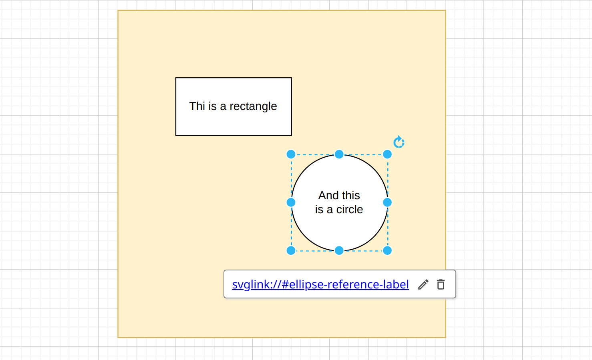

# sphinxcontrib-svg-links

*sphinxcontrib-svg-links* in short *svg-links* let you 
link from SVG elements anywhere, even to Sphinx labels.

## Installation

Install the package

```{bash}
$ pip install sphinxcontrib-svg-links
```

Add the extension to your conf.py

```{python}

extensions = [
        ...,
        
        'sphinxcontrib_svg_links.extension',
        
        ...,
        ]
```

## How it works

In this SVG file fragment

```{svg}
        <a xlink:href="svglink://#other-reference-label">
            <ellipse cx="235" cy="220" rx="40" ry="40" fill="rgb(255, 255, 255)" stroke="rgb(0, 0, 0)"
                     pointer-events="all"/>
        </a>
```

the ellipse element links to *svglink://#ellipse-reference-label* which is a pseudo URI. 
Such links can be comfortably set utilizing draw.io or any other capable SVG editor.



The pseudo URI *svglink://#ellipse-reference-label* is a reference to a Spinx label
defined elsewhere: 

```{rst}
.. _ellipse-reference-label:

The queen of elements - the ellipse
-----------------------------------

```

*svg-links* introduces a new attribute **svglinks** to the *image*, and *figure* directive.

```{rst}
.. image:: ../diagram.svg
  :svglinks: True
  :width: 400
  :alt: Beautiful diagram

.. figure:: ../diagram.svg
  :svglinks: True
  :width: 400
  :alt: Beautiful diagram
    
  What a nice diagram!
    
```

If the **svglinks** attribute exists and is *True*, then the SVG will be not treated as an image 
but will be embedded as an HTML <object>. So you can decide which SVG image will have links and 
which may not.  

*svg-links* will the parse the SVG file and replace the pseudo URIs wil relative
links to the sphinx labels in the document.

## Demonstration

ToDo

