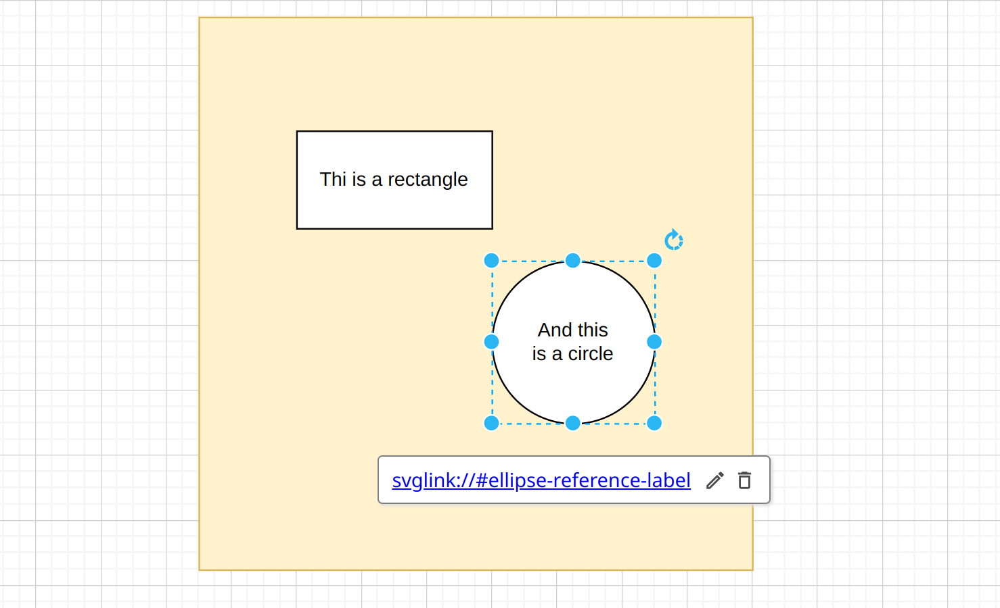

# sphinxcontrib-svg-links

*sphinxcontrib-svg-links* in short *svg-links* let you 
link from SVG elements anywhere, even to Sphinx labels.

## Demonstration

[Demo]

## How it works

In this SVG file fragment

```{svg}
        <a xlink:href="svglink://#other-reference-label">
            <ellipse cx="235" cy="220" rx="40" ry="40" fill="rgb(255, 255, 255)" stroke="rgb(0, 0, 0)"
                     pointer-events="all"/>
        </a>
```

the ellipse links to *svglink://#other-reference-label* which is a pseudo URI. 
Such links can be comfortably set utilizing draw.io or any other capable SVG editor.



The pseudo URI *svglink://#other-reference-label* is a reference to a Spinx label
defined elsewhere: 

```{rst}
.. _other-reference-label:

A new chapter
-------------

```

*svg-links* introduces a new attribute **svglinks** to the *image*, and *figure* directive.

```{rst}
.. image:: ../diagram.svg
  :svglinks: True
  :width: 400
  :alt: Beautiful diagram

.. figure:: ../diagram.svg
  :svglinks: True
  :width: 400
  :alt: Beautiful diagram
    
  What a diagram!
    
```


