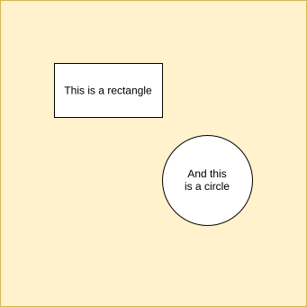

The top level diagram
=====================

Example usage:
::

    .. image:: ../output.svg
      :svglinks: True
      :width: 400
      :alt: Alternative text

  This is the caption of the figure (a simple paragraph).

  The legend consists of all elements after the caption.  In this
  case, the legend consists of this paragraph and the following
  table:

